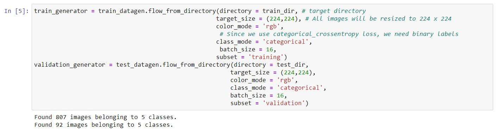
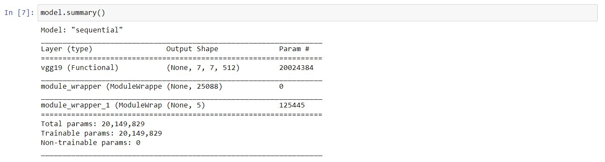
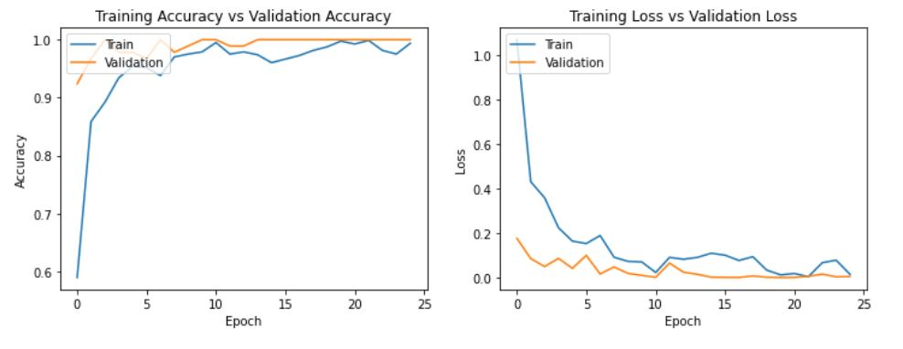
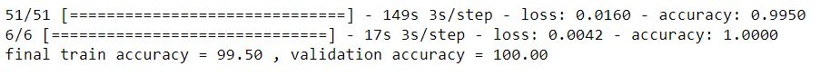

# Yoga Pose Classifier
Yoga Pose Classifier using Coral PoseNet (DL framework similar to OpenPose)
## Coral PoseNet
In 2018, Google announced the TensorFlow release of PoseNet, a ML model capable of detecting persons in images and estimating the location of their body parts, Known as Pose Estimation.

Pose Estimation refers to Computer Vision techniques that detects Human Figures in images and video, so that one could determine, for example, where someone’s elbow, shoulder or foot show up in an image. PoseNet does not recognize who is in an image, it is simply estimating where key body joints are.

For more info, visit [Coral PoseNet](https://github.com/google-coral/project-posenet)

### Important concepts


__Pose__: at the highest level, PoseNet will return a pose object that contains a list of keypoints and an instance-level confidence score for each detected person.

__Keypoint__: a part of a person’s pose that is estimated, such as the nose, right ear, left knee, right foot, etc. It contains both a position and a keypoint confidence score. PoseNet currently detects 17 keypoints illustrated in the following diagram:


__Keypoint Confidence Score__: this determines the confidence that an estimated keypoint position is accurate. It ranges between 0.0 and 1.0. It can be used to hide keypoints that are not deemed strong enough.

__Keypoint Position__: 2D x and y coordinates in the original input image where a keypoint has been detected.

### About My Model:
Prior to training a model, I have split the dataset into three parts of unequal size that represent the data well:

- **Training**. This part of the dataset is fit to your model to train it. This set constitutes the majority of the original dataset.
- **Testing**. A test dataset is an independent group of data, often gathered from the original data, that you use to confirm the performance of the built model.
- **Validating**. A validation set is a smaller independent group of examples that you use to tune the model's hyperparameters, or architecture, to improve the model.

__Training Set__: 
I have provided an easy way to train model and following is the code to train our dataset model:
```python
train_generator = train_datagen.flow_from_directory(directory = train_dir,
                                                    target_size = (224,224),
                                                    color_mode = 'rgb',
                                                    class_mode = 'categorical',
                                                    batch_size = 16,
                                                    subset = 'training')
```



__Model Summary__:
The activation function used is Rectified Linear Unit (ReLU) which is applied for feature extraction on keypoints of each frame.
```python
Model.summary()
``` 



__Accuracy Evaluation__:
Below Code, will give you training and validation accuracy:
```python
# Returns the loss value & metrics values for the model in test mode
train_loss, train_acc = model.evaluate(train_generator)
test_loss, test_acc   = model.evaluate(validation_generator)
print("final train accuracy = {:.2f} , validation accuracy = {:.2f}".format(train_acc*100, test_acc*100))
``` 



Final results:
```
Training Accuracy    : 99.50
Validation Accuracy  : 100.00
```



### Areas of Application
The main areas of application for pose estimation technologies are:

1. __FITNESS__
Fitness is the first thing that immediately comes to mind when we think about automatic pose detection. Many startups are exploring AI capabilities for pose recognition in this area.

     This technology allows them to create AI-powered personal trainers that check how customers perform exercises and whether they need instructions to correct their body position. Such fitness apps democratize services of personal coaching:

- lower cost of having a one-on-one professional trainer
- minimal injury risk

2. __PHYSICAL THERAPY__
Another trend where camera pose estimation is getting traction is physical therapy apps that detect body postures and provide feedback to users about specific physical exercises. The gains, again, are:

- lower cost of care as no to minimal physical therapist involvement is required
- better health outcomes for users
- convenience of at-home exercises

3. __ENTERTAINMENT__
Pose detection software can also help replace expensive motion capture systems used during film and video-game production. And in video games, recognition of movements can help create more immersive experiences. For example, Kinect can track the player’s movements using IR sensors and relay them to her virtual avatar’s actions. The upsides include:

- lower cost of movie production
- more engaging user experience

4. __ROBOTICS__
Controlling robots is yet another application for this computer vision technology. In this case, robots’ rigid logic and movements are replaced with pose detection and estimation algorithms that allow for a more flexible response.

- minimal recalibration
- quick adaptation to a variety of environments


### Requirements:
[numpy](https://pypi.org/project/numpy/)\
[pandas](https://pypi.org/project/pandas/)\
[matplotlib](https://pypi.org/project/matplotlib/)\
[seaborn](https://pypi.org/project/seaborn/)\
[tensorflow](https://pypi.org/project/tensorflow/)\
[keras](https://pypi.org/project/keras/)\
[pillow](https://pypi.org/project/Pillow/)\
[opencv](https://pypi.org/project/opencv-python/)
